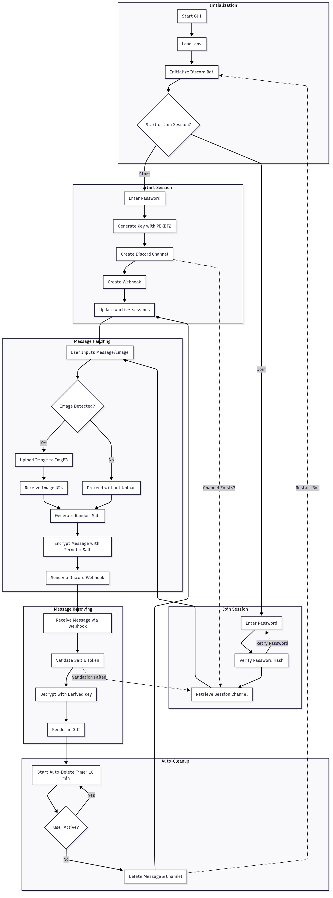

# StealthChat – Secure Anonymous chat

StealthChat is an encrypted messaging / images application that leverages Discord channels as a free, anonymous backend for hosting chat sessions securely. Messages are fully encrypted, temporary, and anonymous, ensuring complete privacy without additional hosting costs.


## 🟢Executable Usage🟢

A compiled `.exe` version is available for Windows users. It includes full functionality and does **not** require Python to be installed. You still need to provide your own `.env` file with valid keys.
Please do not abuse it.

## Installation

Clone the repository:

```bash
git clone https://github.com/KfirMorad/StealthChat.git
cd StealthChat
```

For full dev dependencies installation:

```bash
pip install -r requirements.txt
```

Or for minimal installation:

```bash
pip install requirements-minimal.txt
```

## Environment Variables

Create a `.env` file in the root folder with the following:

```env
GUILD_ID=         # Your Discord server's ID
BOT_TOKEN=        # The bot token from Discord Developer Portal
WEBHOOK_URL=      # Webhook used to send messages in active sessions tracking channel
SESSIONS_CHANNEL_ID=  # Channel where active sessions are tracked
IMGBB_API_KEY=    # API key for uploading images to ImgBB
```

## Features

- End-to-end encryption using Fernet with unique salt per message
- Anonymous sessions using Discord as a free backend
- Smart session tracking with Discord channel names
- Messages self-destruct after 10 minutes
- Clipboard image paste (Ctrl+V) with QR or link sharing
- Auto-cleanup of inactive channels

## API Reference

### 🟣 Discord API

Used for:

- Creating session channels
- Posting messages via webhooks
- Managing webhooks dynamically
- Tracking active sessions by channel names

[Discord API Docs](https://discord.com/developers/docs/intro)

---

### 🟡 ImgBB API

Used for:

- Uploading clipboard-pasted images
- Getting a shareable image link or QR code

[ImgBB API Docs](https://api.imgbb.com/)

## Discord Server & Bot Setup

1. **Create a Discord Server** (or use an existing one).
2. Go to the [Discord Developer Portal](https://discord.com/developers/applications).
3. Create a new application and add a **bot** to it.
4. Under \"Bot\" settings:
   - Enable **Message Content Intent**
   - Enable **Server Members Intent**
   - Copy the **Bot Token** (use it in `.env`)
5. Under \"OAuth2 > URL Generator\":

   - Scopes: `bot`
   - Permissions:
     - `Manage Channels`
     - `Manage Webhooks`
     - `Send Messages`
     - `Read Message History`
     - `Attach Files`
   - Copy and open the generated URL to invite the bot to your server.

6. In Discord, create a **text channel** for tracking active sessions (e.g., `#active-sessions`). Copy its ID and put it in `.env` as `SESSIONS_CHANNEL_ID`.

7. Create a **Webhook** in a test channel and copy its URL into `.env` as `WEBHOOK_URL` for testing.

---

> 🔧 The bot will dynamically create and manage new channels and webhooks for each session.

## Run Locally

After installing dependencies and creating the `.env` file:

```bash
python gui.py
```

## Full Encryption & Session Flow



## Contributions

We welcome pull requests, ideas, and improvements.
If you'd like to contribute, please open an issue or submit a PR — especially for bug fixes, UI improvements, or feature suggestions.
Let’s make StealthChat better together.

---

## Disclaimer

StealthChat is intended for **educational, ethical, and personal privacy purposes only**. The developers are not responsible for any misuse of this software.

By using this application, you agree to comply with all relevant laws and regulations in your jurisdiction. Do not use StealthChat to engage in illegal, malicious, or unauthorized activities.

> This tool does **not** guarantee absolute anonymity or protection against targeted surveillance.
